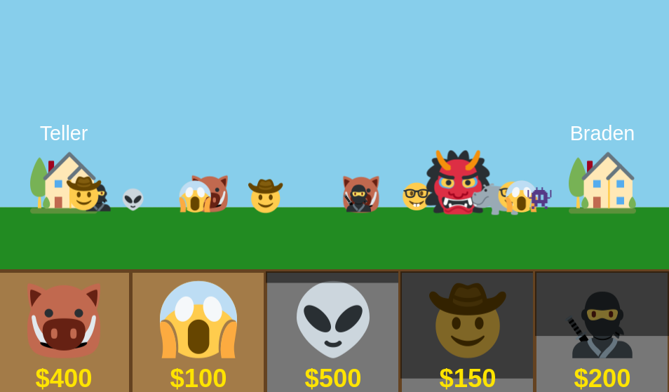

# WebSocket Tower Defense Game 🏗️
## A super simple attempt at a multiplayer web game :) Filled to the brim with slightly poor decisions and a can-do spirit 🥲

This project exists as the biggest challenge in my journey to understand websockets and asynchronous Rust as a whole. I aimed to create a game similar to [The Battle Cats](https://battlecats.club/en/) minus any of the charm. 

The server state is written entirely in Rust, spawning 2 distinct Tokio tasks for handling the HTTP server and the WebSocket-Associated Game states. A `LazyLock` backed "deck" is used to initialize a static vector of all available Units, which is created from a static slice of json strings created based on the unit files in the `/units` directory. This is compiled in the build.rs script any time the project is built or run, so if you want to add more units yourself just create some new unit files :)

### Shoot for the moon...

