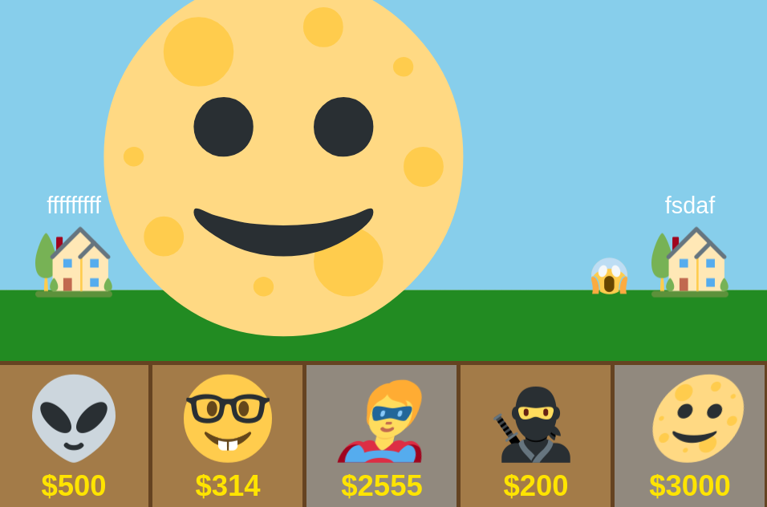

# WebSocket Tower Defense Game 🏗️
## A super simple attempt at a multiplayer web game :) Filled to the brim with slightly poor decisions and a can-do spirit 🥲

This project exists as the biggest challenge in my journey to understand websockets and asynchronous Rust as a whole. I aimed to create a game similar to [The Battle Cats](https://battlecats.club/en/) minus any of the charm. 

### Shoot for the moon...

